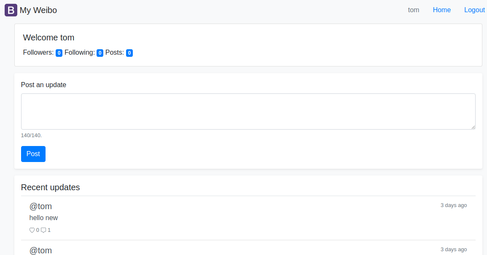

# ai-weibo-py

This repo is to create a sample Weibo (Twitter) app using Flask and Redis

## Major Features

- User Management 
    - Login / Logout
    - Register
    - Follower / Following (TODO)

- Post Management
    - Create Post
    - List Posts
    - Delete Posts (TODO)
    - Comment (TODO)
    - Like (TODO)

## Screenshot

Login Page

Home Page

